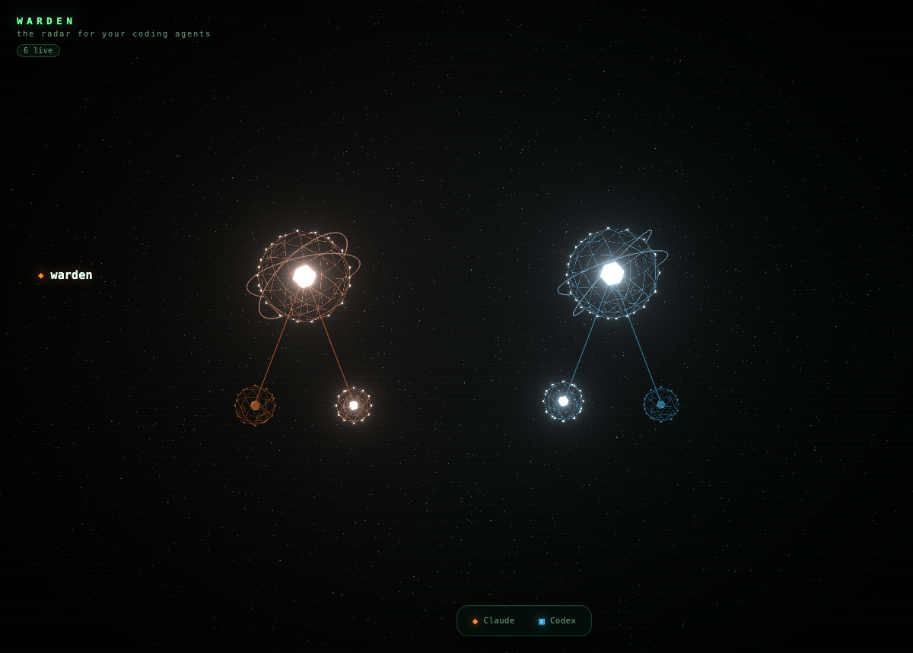

<p align="center">
  
</p>

<h1 align="center">WARDEN</h1>

<p align="center">
  <b>The agent that watches your agents.</b><br/>
  A live radar for your local coding agents.
</p>

<p align="center">
  
  
  
</p>

---

You run Claude Code and Codex all day. A root agent here, a swarm of Explore subagents there, a Codex session in another repo. You never actually see the shape of it: who is working right now, who quietly went idle, whose context window is about to run out.

WARDEN shows you. It is a macOS desktop app that tails the transcripts your agents already write and renders every session as a live agent on a 3D radar. Open it and your whole fleet is on one screen.

It is read-only and fully local. WARDEN never writes to your projects, makes no network calls, and needs no API keys. It only reads the logs your agents already leave on disk.

## What you see

Every globe on the radar maps to a real signal, never a fabricated one.

- **Each agent is a globe.** Its core burns from a dim ember to white-hot as its context window fills, so a glance tells you who is running out of room.
- **Subagents orbit their parent.** The forest mirrors the real spawn hierarchy: a root agent, the Explore or planning subagents it launched, and their children in turn.
- **Colour is the harness.** Claude Code is emerald, Codex is violet, an unknown harness stays a neutral slate. Colour is always paired with a glyph and a label, so it is never the only signal.
- **Motion is status.** A working agent pulses bright and quick, an idle one breathes slow and dim.
- **Rails are folders.** Agents group onto one rail per project directory, so two agents in the same repo sit together.

Click a globe to fly the camera in and open its detail panel: the exact context-window breakdown, a live feed of its recent tool calls and messages, its real children, and its model, uptime, and estimated cost.

## How it works

```
  Claude Code / Codex transcripts
        |   file adapters: startup backfill + live FSEvents tail
        v
   canonical IR   ->   SQLite + FTS5   (byte-offset watermarks)
        |
        v
   radar recompute: liveness, context weight, subagent hierarchy
        |   radar_state
        v
   R3F constellation + detail panel   (the window opens straight to it)
```

- **Watch.** File adapters tail the logs your agents already produce (`~/.claude/projects/**/*.jsonl` and `~/.codex/sessions/**/rollout-*.jsonl`). Startup backfills history, then `FSEvents` streams new writes live. Watermarks are byte offsets, so a coalesced burst of writes is never double-counted and schema drift never drops a session.
- **Normalize.** Every harness, whatever its log format, maps into one canonical Rust intermediate representation and lands in a local SQLite + FTS5 store. Adding a new agent is one adapter file with zero downstream changes.
- **Compute.** On every change, WARDEN recomputes the live forest: which sessions are open, how full each context window is, and which sessions spawned which, resolved from the real subagent links.
- **Render.** The forest is pushed to the UI as a `radar_state` event and drawn by a React Three Fiber scene. The window opens straight to the radar, so there is nothing to summon and nothing to configure.

Honest visualization is the rule throughout: a globe's heat, a subagent link, an activity line, all trace to a computed value. Nothing on screen is invented.

## Quickstart

Prerequisites: macOS (Apple Silicon), a Rust toolchain (stable, 1.85 or newer), and [pnpm](https://pnpm.io).

```bash
pnpm install
pnpm tauri dev      # build and launch the app
```

The window opens straight to the radar. If you have Claude Code or Codex sessions on disk, your agents appear within a second or two. Otherwise the radar waits, watching, until one starts.

Build a distributable macOS app:

```bash
pnpm tauri build
```

### Try the radar in a browser

You can eyeball the radar in a plain browser against a mock forest, no Rust build required:

```bash
pnpm dev            # then open http://127.0.0.1:1420/radar-lab.html
```

## Configuration

WARDEN needs no configuration. Every setting is an optional override (see [`.env.example`](.env.example)):

| Variable | Meaning |
|---|---|
| `WARDEN_DB_PATH` | Where the SQLite index lives (default `~/.warden/warden.db`). |
| `WARDEN_CLAUDE_PROJECTS` | Claude Code transcript root (default `~/.claude/projects`). |
| `WARDEN_CODEX_SESSIONS` | Codex session root (default `~/.codex/sessions`). |

## Project layout

```
src-tauri/            Rust core (single crate)
  src/ir.rs           canonical intermediate representation
  src/ingest/         Adapter trait + registry + claude_code.rs / codex.rs
  src/store.rs        rusqlite + FTS5 store (byte-offset watermarks)
  src/radar/          the live agent-forest model
  src/scheduler/      watch (live ingest) and radar (recompute) drivers
  src/platform/       the macOS seam
  src/lib.rs          Tauri setup: window, tray, watchers
  src/commands.rs     Tauri IPC commands
web/                  TypeScript + React Three Fiber island
  main.ts             Tauri event router
  viz/modules/radar/  the constellation, layout, detail panel, hover card
  viz/views/war-room/ the app shell (brand, filter, breadcrumb)
  viz/shared/         state, types, theme, scene helpers
docs/radar.png        the screenshot above
```

More detail on the layering rules lives in [`CLAUDE.md`](CLAUDE.md).

## Development

```bash
cd src-tauri && cargo test        # Rust unit + golden tests
cd src-tauri && cargo clippy      # lint (denies production unwrap)
pnpm build                        # tsc + vite bundle
pnpm test                         # vitest
pnpm check:arch                   # frontend import-boundary check
```

The frontend is feature-sliced: imports point one direction only (`app -> views -> modules -> shared`), enforced by `pnpm check:arch`. The Rust core keeps `tauri` confined to `lib.rs` and `commands.rs`, with all OS-specific code isolated in `platform/` so a future port is one adapter file.

## License

[MIT](LICENSE).
